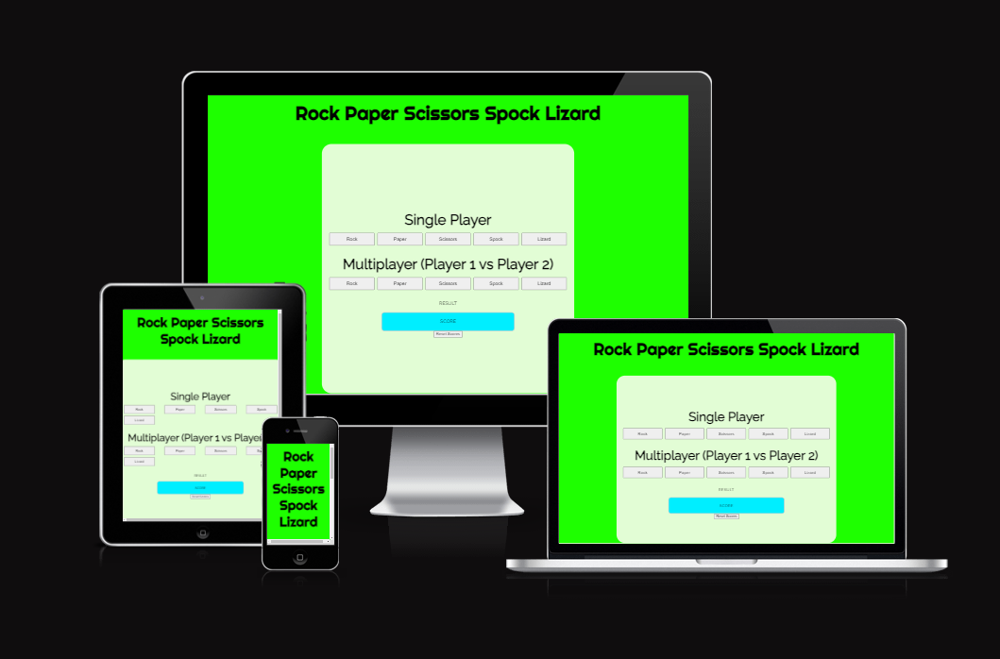

# Rock Paper Scissors Spock Lizard

Welcome to the **Rock Paper Scissors Spock Lizard** game! This game is a fun twist on the classic Rock Paper Scissors, adding two additional choices: Spock and Lizard. The game can be played in single-player mode against the computer or in multiplayer mode with another player.

## Features

- **Single Player Mode:** Play against the computer.
- **Multiplayer Mode:** Play against another player.
- **Score Tracking:** Keep track of scores for Player 1, Player 2, and the computer.
- **Responsive Design:** The game interface adjusts for different screen sizes.

## How to Play

1. **Single Player Mode:**
    - Click on one of the buttons to choose Rock, Paper, Scissors, Spock, or Lizard.
    - The computer will randomly select its choice.
    - The result of the game will be displayed, and scores will be updated accordingly.

2. **Multiplayer Mode:**
    - Click on one of the buttons to choose Rock, Paper, Scissors, Spock, or Lizard for Player 1.
    - Player 2 will enter their choice through a prompt.
    - The result of the game will be displayed, and scores will be updated accordingly.

3. **Reset Scores:**
    - Click on the "Reset Scores" button to reset all scores to 0.

## Game Rules

- **Rock crushes Scissors**
- **Rock crushes Lizard**
- **Paper covers Rock**
- **Paper disproves Spock**
- **Scissors cuts Paper**
- **Scissors decapitates Lizard**
- **Spock smashes Scissors**
- **Spock vaporizes Rock**
- **Lizard eats Paper**
- **Lizard poisons Spock**

If both players choose the same item, the result is a tie.

## Technologies Used

- **HTML:** Structure of the web page.
- **CSS:** Styling of the web page.
- **JavaScript:** Game logic and interactivity.
- **Google Fonts:** Custom fonts.

## Testing 

- I confirmed that the game results are correct and in order.
- I confirmed that the colors and fonts are easy to read and accessible by testing it with Lighthouse in DevTools.

- I confirmed the project is responsive by testing it at https://ui.dev/amiresponsive .

## Bugs

- 

## Validater testing 

- HTML
 

- CSS

## Deployment

- This site was deployed to Github pages. The steps to deploy are as follows:

-In the Github repository , navigate to the settings tab.
-From the sourse section drop-down menu, select the master branch.
-Once the master branch have been selected, the page provided the link to the complete website.

The live link can be found here - 

